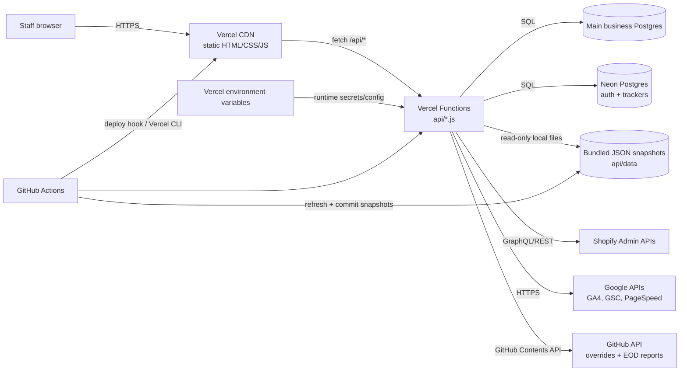
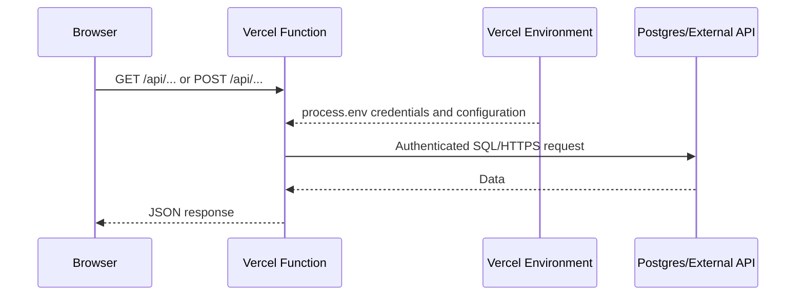
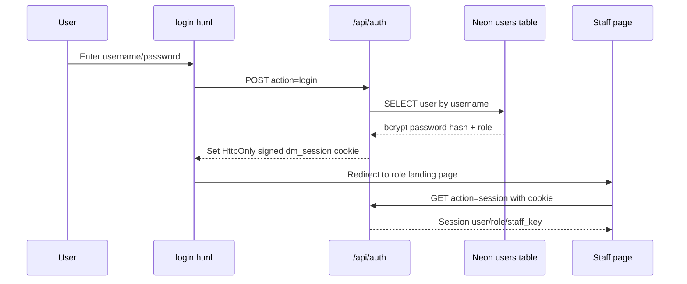
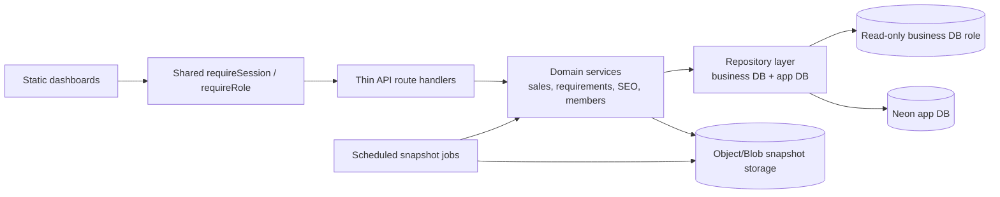

# Digital Marketing Staff Dashboard — Architecture

**Document status:** As-is architecture with improvement plan  
**Last reviewed:** 2026-08-19  
**Deployment platform:** Vercel  
**Primary application style:** Static HTML dashboards plus Node.js Vercel Functions  

## 1. Executive summary

This repository is a server-rendered API and static-site hybrid. It is **not a Next.js application** and it does not have a traditional long-running application server.

- Vercel serves `login.html`, `pages/**/*.html`, CSS, and browser JavaScript as static CDN assets.
- Each top-level `api/*.js` file is deployed as an independent Node.js Vercel Function.
- Browser pages call the functions with relative URLs such as `/api/auth?action=session` and `/api/requirement?fn=mahima-req1`.
- Vercel injects configured environment variables into the serverless function runtime. These values are read through `process.env` and are not sent to the browser unless application code explicitly returns them.
- `DATABASE_URL` (or the legacy `PG*` variables) connects the functions to the main business Postgres database.
- `AUTH_DATABASE_URL` connects to a separate Neon Postgres database used for users, attribution, and several tracker tables. Some tracker features can use `FEED_TRACKER_DB_URL` instead.
- Shopify, Google APIs, PageSpeed, and GitHub are called only from server-side functions by using credentials stored as Vercel environment variables.
- Large historical reports are stored as committed JSON snapshots in `api/data/`. Functions read these bundled files first and use live Shopify/Postgres queries for refreshes or missing snapshots.
- GitHub Actions refreshes snapshot files, commits them, and triggers Vercel deployments.

The current design is optimized for rapid delivery and cached reporting. Its main weaknesses are inconsistent authorization, very large function bundles, duplicated routing logic, and deployment/data-refresh coupling.

## 2. System context



## 3. Repository inventory

The audit covered every tracked project file.

| Area | Purpose | Audit count |
|---|---|---:|
| `api/*.js` | Deployed Vercel Functions | 12 |
| `api/scripts/*.js` | Local/CI snapshot generators; excluded by `.vercelignore` | 3 |
| `api/data/*` | Report snapshots and order overrides | 495 files, about 247.5 MB |
| `pages/**/*.html` | Staff, sales, EOD, SEO, and monitoring dashboards | 38 |
| `germany-sales-decline-dashboard/` | Static Germany report sub-site and documentation | 22 |
| `scripts/*.js` | Bulk refresh, attribution, and deployment checks | 8 |
| `.github/workflows/*.yml` | Snapshot refresh and deploy automation | 3 |
| `assets/` | Shared CSS and browser JavaScript | 2 |
| Root HTML/config | Login, Vercel config, package metadata | 6 |

Validation performed during this review:

- All 25 JavaScript files passed `node --check`.
- All 496 JSON files parsed successfully.
- Environment-variable references, SQL connections, external API calls, page-to-API references, Vercel configuration, and workflows were inspected.
- This was a source/configuration audit. It did not read secret values or prove connectivity to production databases and third-party APIs.

## 4. Deployment and runtime model

### 4.1 Static frontend

The root rewrite in `vercel.json` maps `/` to `/login.html`. Other HTML pages are served directly from their repository paths. There is no build step and no frontend framework bundle.

Authentication guards in the HTML pages call `/api/auth?action=session`. The browser receives a signed, HTTP-only `dm_session` cookie after login. Staff pages then use `fetch()` to call one or more serverless APIs.

### 4.2 Serverless backend

Vercel converts each top-level `api/*.js` file into a function endpoint:

| Endpoint | Responsibility | Main dependencies |
|---|---|---|
| `/api/auth` | Login, logout, session, user administration, EOD GitHub operations | Neon auth DB, HMAC secret, GitHub |
| `/api/assign-order` | Persist manual order-to-staff overrides by committing JSON | GitHub Contents API |
| `/api/generate-staff-attribution` | Classify staff orders and upsert attribution | Session auth, main DB, Shopify, Neon |
| `/api/intel-api` | SEO, Germany reports, organic revenue | Main DB, SEMrush/Neon DB, PageSpeed, public websites |
| `/api/members-api` | Hetheesha, Jakshan, Sajeepan, Sonya, Theekshy, Thivajini, monitor reports, **Thivajini Req5 Feed Optimization**, **Sajeepan Automation Keyword Finder** | Main DB, tracker Neon DB, Shopify FR, **LLM providers via `lib/feed/`**, **SerpAPI + Google Ads API via `lib/lens-keywords/`** |
| `/api/muguntha` | Team performance, tag listing, cache warming | Main DB, Shopify UK, snapshots |
| `/api/requirement` | Multi-staff requirement router | Main DB, Shopify, GA4, GSC, snapshots, tracker Neon DB |
| `/api/sales` | 2026/staff sales reporting and Jackson reporting | Shopify, snapshots |
| `/api/sales25` | 2025 UK group sales reporting | Shopify, main DB fees, snapshots |
| `/api/salesde25` | 2025 Germany sales reporting | Shopify, snapshots |
| `/api/salesuk` | 2026 UK group sales reporting | Shopify, main DB fees, snapshots |
| `/api/staff-id-performance` | Product performance for configured staff IDs | Session auth, main DB, Neon attribution |

`vercel.json` raises selected function durations to 15, 30 or 300 seconds. `api/members-api.js` was raised from 60s to 300s on 2026-08-20 so a Req5 generation (provider call plus fallback) cannot be cut off mid-flight. `/api/intel-api` is not listed there and therefore uses the platform/project default.

The module-level connection pools and in-memory caches can be reused when a function instance stays warm. They are not shared across instances and disappear on cold starts.

### 4.3 Environment variable injection

Vercel injects variables when a function starts. The frontend cannot use `process.env`, and this project does not use any `NEXT_PUBLIC_*` variables.



Variables must be scoped separately for Vercel Production, Preview, and Development. Preview deployments should not automatically receive production database credentials.

## 5. Data architecture

### 5.1 Main business Postgres

Connection priority is generally:

1. `DATABASE_URL`
2. Separate `PGHOST`, `PGPORT`, `PGDATABASE`, `PGUSER`, and `PGPASSWORD`

`PGSSL=require` enables TLS with `rejectUnauthorized: false` in most modules.

The application reads operational schemas including:

- `order_management`: orders, order items, sources, and sub-sources
- `listings`: Shopify, Amazon, and eBay listings and mappings
- `inventory`: products and stock
- `google_ads`: campaigns, performance, search terms, products, and assets
- `google_search_console`: query and page performance
- `google_analytics`: organic landing-page revenue
- `amazon_campaigns`: Amazon campaign and search-term data
- `accounting`: Shopify transaction fees

The main database is predominantly read-only from the dashboard's perspective.

### 5.2 Neon Postgres

`AUTH_DATABASE_URL` is the dedicated Neon connection for authentication and application-owned data. Current tables include:

- `users`
- `public.staff_order_attribution`
- `public.jefri_req6_tracker`
- `public.hetheesha_fix_tracker`
- `public.hetheesha_fix_tracker_r2`
- `public.feed_optimization_tracker` (Sajeepan Req4 — UK ad-waste tracker; **not** the feed-copy workflow)
- `public.thivajini_feed_batch`, `_term_selection`, `_generation`, `_llm_attempt`,
  `_variant`, `_selection`, `_perf_snapshot`, `_provider_model`
  (Thivajini Req5 Feed Optimization — created by a **versioned migration**, not runtime DDL)

Some member/tracker code uses `FEED_TRACKER_DB_URL || AUTH_DATABASE_URL`. SEMrush/GEO data uses `semrush || NEON_DATABASE_URL || DATABASE_URL`. These fallbacks mean the exact database boundary depends on environment configuration.

Several request handlers run `CREATE TABLE IF NOT EXISTS` or `ALTER TABLE` at runtime. This is convenient but means schema migration is mixed with request processing.

### 5.3 Snapshot store

`api/data/` contains monthly Shopify/sales snapshots, requirement snapshots, allocations, and `order-overrides.json`.

Typical read flow:

1. Resolve staff/group and month from query parameters.
2. Check the warm-instance in-memory cache.
3. If `refresh=1` is not present and a matching snapshot exists, read it with `fs.readFileSync`.
4. Otherwise query Shopify/Postgres live.
5. Normalize and aggregate the result.
6. Cache the response in memory for the life of the warm function instance.

Snapshots make historical pages fast, but they are bundled into deployments and make source control, function packaging, and redeployment part of the data pipeline.

### 5.4 GitHub-backed writes

Two features use GitHub as persistence:

- `/api/assign-order` reads and writes `api/data/order-overrides.json` in this repository. The commit triggers a deployment; sales functions then apply the override.
- `/api/auth?action=eod-*` reads and writes Markdown EOD files in the separate `eod-reports` repository.

Vercel's function filesystem is read-only/ephemeral, so these writes cannot be stored in a local file during a request.

## 5.5 Feed Optimization (Thivajini Req5) — added 2026-08-20

A feature of the existing dashboard, not a second application.

**Routing.** `api/members-api.js` forwards `?member=thivajini&type=req5-*` to
`lib/feed/req5.js`. Thivajini's Req1–Req4 handlers are untouched.

**Why helpers live in `lib/feed/`, not `api/lib/`.** Vercel turns *every* file
under `api/` into its own Serverless Function, including nested ones. This
project already deploys exactly **12** functions — the Hobby-plan ceiling, which
is why `.vercelignore` already excludes `api/scripts/`. Putting six helper
modules under `api/lib/` would request 18 functions and fail the deployment.
Root-level `lib/` is bundled into the calling function by Vercel's dependency
tracing instead. **`lib/` must never be added to `.vercelignore`.**

| Module | Responsibility |
|---|---|
| `lib/feed/req5.js` | Endpoint routing, orchestration, provider chain |
| `lib/feed/sql.js` | Read-only Ledsone queries + the France identity constants |
| `lib/feed/repo.js` | Neon persistence (no DDL) |
| `lib/feed/prompt.js` | The single versioned prompt builder + output schema |
| `lib/feed/validate.js` | Output validation and evidence confidence |
| `lib/feed/providers.js` | Local → Gemini 1 → Gemini 2 routing, model discovery, token budget, quota accounting |
| `lib/feed/notes.js` | Dependency-free "known gaps" vocabulary + freshness rule |
| `lib/feed/gate.js` | Feed Gate (`ELIGIBLE` / `CHECK` / `NOT_ELIGIBLE`) + blocking vs non-blocking gap classification |
| `lib/feed/cycle.js` | Durable one-button Optimization Cycle state machine (dependency-injected, no `req5` import) |
| `lib/feed/session.js` | Shared `requireSession` (lifted from `api/staff-id-performance.js`) |

**Source-of-truth split — Req5 uses exactly two variables, with NO fallback:**

```text
Req5 operational reads   DATABASE_URL       ->  Ledsone DB            (read-only)
Req5 workflow / history  AUTH_DATABASE_URL  ->  application Neon DB   (read/write)
```

Ledsone DB remains the operational truth for products, PPC, orders and feed
content. Neon holds workflow state and **immutable evidence snapshots** only, so
a historical generation stays reproducible even though
`google_ads.merchant_products` has no date column. Neon is never queried as
"the current title".

**Req5 deliberately does NOT use the historical
`FEED_TRACKER_DB_URL || AUTH_DATABASE_URL` chain** (corrected 2026-08-20). An
implicit fallback can silently point workflow writes at a different database —
the class of defect §10 finding 4 records. Missing configuration fails loudly:

| Condition | Error code | HTTP |
|---|---|---|
| `DATABASE_URL` absent | `REQ5_LEDSONE_DATABASE_URL_MISSING` | 503 |
| `AUTH_DATABASE_URL` absent | `REQ5_APP_DATABASE_URL_MISSING` | 503 |
| `AUTH_DATABASE_URL` resolves to the Ledsone DB | `REQ5_APP_TARGET_IS_LEDSONE` | 503 |
| Migration not applied | `MIGRATION_NOT_APPLIED` | 503 |

Older dashboard modules keep their own variables unchanged — `intel-api.js` still
uses `semrush || NEON_DATABASE_URL || DATABASE_URL` for SEMrush/GEO (unchanged
by this correction), and the Sajeepan/Hetheesha trackers still use
`FEED_TRACKER_DB_URL || AUTH_DATABASE_URL`.
This correction is scoped to Req5 only, and a regression test asserts those
legacy chains are untouched.

> ✅ **Resolved 2026-08-20 — target corrected.** An earlier revision pointed
> Req5 workflow/history at `NEON_DATABASE_URL`. That was wrong for this
> repository. `NEON_DATABASE_URL` is documented in §8.1 as the *optional
> SEMrush/GEO* Neon DB and is consumed as such by `intel-api.js`;
> `AUTH_DATABASE_URL` is the dedicated Neon database for authentication and
> application-owned data / trackers — which is exactly what Req5 workflow state
> is. Live evidence settled it: all 11 `thivajini_feed_*` tables already exist in
> the `neondb` database reached through `AUTH_DATABASE_URL`, so the
> `MIGRATION_NOT_APPLIED` 503 was Req5 looking in the wrong place, not a missing
> migration. Req5 now reads `AUTH_DATABASE_URL` and nothing else, and a
> regression test asserts no file under `lib/feed/` reads `NEON_DATABASE_URL`.
> The prior assumption is recorded rather than hidden; see
> `06_VALIDATION/2026-08-20_dilaikshan_DM-2026-08-THIV01_CONTINUATION-VALIDATION.md`
> Addendum 3. `req5-telemetry` still reports `current_database`, `current_user`
> and the neighbouring public tables, so the reached target stays provable at
> runtime.

### 5.5.3 Req5 staff workflow — final architecture (2026-08-21)

The Feed Optimization application moved **out of** `pages/thivajini.html`. That
page now carries only a card that links to it, and shrank from ~218 KB to
~120 KB. Req1–Req4 are untouched.

```text
pages/thivajini/feed-optimization/
  index.html       main workspace: setup -> running -> report (one view at a time)
  cycle.html       full audit: summary, timeline, per-product technical detail
  monitoring.html  Active / Ready for Review / Completed
  history.html     one card per cycle
  feed.css         shared presentation
  feed.js          shared behaviour: transport, formatting, Feed Gate wording,
                   busy guard, focus-managed layers
  workspace.js     the workspace controller
```

**No new serverless function.** Everything still routes through
`api/members-api.js`; the project stays at its 12-function Hobby ceiling
(verified in the deployment's `lambdaRuntimeStats`, and asserted by a test).

#### The staff workflow

```text
Run Cycle → Final Report → Select Variants → Customize/Download
          → Manual Upload → Start Monitoring → Verdict → Iteration/History
```

ONE primary action: **Run Optimization Cycle**. There is no separate Start
Batch, Load Candidates, Search-term Review, Approved Variants or Export History
button — those were implementation concepts, not staff steps.

#### The cycle is a durable state machine, not a long request

A Vercel Function cannot hold a ten-product run in memory, and a 300 s
synchronous request would be one timeout away from losing everything. So the
cycle lives in Postgres (migration 003):

| Table | Holds |
|---|---|
| `thivajini_feed_cycle` | cycle status, settings, counts, source cutoffs, idempotency key |
| `thivajini_feed_cycle_product` | per-product state, Feed Gate outcome, result code, evidence snapshot |
| `thivajini_feed_cycle_event` | the timeline shown on `cycle.html` |

```text
CREATED → PREPARING → EVALUATING_PRODUCTS → FETCHING_SEARCH_EVIDENCE
        → GENERATING → VALIDATING → BUILDING_REPORT
        → COMPLETED | COMPLETED_WITH_WARNINGS | FAILED
```

`advanceCycle()` claims ONE product with `FOR UPDATE SKIP LOCKED`, runs it, and
returns. The browser calls it repeatedly. Consequences:

* provider calls are **sequential by construction** — ten products can never
  become a ten-request Gemini burst;
* every request is short, so no Vercel timeout is possible;
* a refresh, a dropped connection or a platform retry resumes the same run.

**Idempotency.** `req5-cycle-create` takes an `idempotency_key` with a unique
partial index behind it. A double click, a mid-request refresh or a retry all
return the **same** cycle — never a second set of AI calls.

**Per-product isolation.** A product that throws is marked `FAILED` and the
cycle continues. The terminal state becomes `COMPLETED_WITH_WARNINGS` and a
report is still produced, with a result per row: `Generated`,
`Skipped — Feed Gate`, `Skipped — insufficient evidence`, `Generation failed`,
`Validation failed`.

#### One generation implementation

`generateForProduct()` in `lib/feed/req5.js` is the single core for steps 3 and
5–8. Both `handleGenerate` (manual) and the cycle call it, so the two paths
cannot drift. A test asserts `runProviderChain` is invoked in exactly one place.

#### The Feed Gate decides whether an AI call happens

The written workflow requires `Feed Eligible = Y` before a call is spent, and
no authoritative France eligibility source exists. So by default a
`Check Required` product is reported as **Skipped — Feed Gate** and **no AI call
is made**. An operator may explicitly opt into draft-only generation for those
products; the choice is recorded on the cycle and shown on `cycle.html`. It
never marks anything Eligible.

#### A download is not a go-live

`Customize & Download` sends `monitoring_start_mode: 'DEFERRED'` — no baseline,
no monitoring plan, export status `DOWNLOADED_NOT_LIVE` (migration 004).
Monitoring begins only through `req5-monitoring-start`, which asks
*"Have the selected feed changes been uploaded and gone live?"*, refuses a future
date, and anchors the baseline to the 30 days ending the day before go-live.

#### Routes (all through `members-api.js`, all session-guarded)

| Read | Write |
|---|---|
| `req5-cycle-status` | `req5-cycle-create` |
| `req5-cycle-report` | `req5-cycle-advance` |
| `req5-cycle-detail` | `req5-cycle-select` |
| `req5-cycle-history` | `req5-monitoring-start` |

### 5.5.2 Req5 staff workflow UI (2026-08-20)

`pages/thivajini.html` tab 5 is a **true tab/step panel** workflow, not a stack of
tables. Exactly one `<section class="r5-screen">` is visible at a time; `r5Step()`
toggles the `hidden` attribute and maintains `aria-selected` plus a roving
`tabindex`, and the tablist handles Arrow/Home/End. Batch and product state live
in `R5` and survive navigation — switching screens never re-fetches data that is
already loaded.

```text
1 Products → 2 Search Terms → 3 Generate → 4 Approved & Export → 5 Monitoring → 6 History
                                                                    (secondary) Diagnostics
```

Provider telemetry, token usage, context size, latency, quota and migration
state moved to **Diagnostics**; they are no longer part of the staff flow.
Product detail opens a right-hand **drawer** (`#r5-drawer`, `role="dialog"`)
instead of appending another table.

**Feed Gate** (`lib/feed/gate.js`) is the user-facing eligibility model:

| Internal | Shown to staff | Badge | Blocks push |
|---|---|---|---|
| source `Y` | `Eligible — Y` | green | no |
| source `N` | `Not Eligible — N` | red | yes |
| `UNKNOWN` / `Check` / blank | `Needs Check` | amber | yes |

`ELIGIBLE` is assigned in exactly one place, guarded by a literal `Y`, and is
**never** derived from stock, presence in the Merchant feed, Ads activity, GPC or
specs. Today FR has no eligibility source, so every product is
`status=CHECK, source=UNVERIFIED, reason="Merchant eligibility status unavailable
in current Ledsone DB"`. The word `UNKNOWN` does not appear anywhere in the
dashboard — a regression test asserts that.

`gate.dataQuality()` classifies every gap as **generation-blocking**,
**production-push-blocking** or **informational**, which produces one row badge
(Complete / Partial / Missing critical data) and the sentence *"You can generate a
draft, but this product is not ready for production push."* A source gap is a
data-quality badge, never a red application error.

**Errors.** `lib/feed/req5.js` maps every configuration code to one staff
sentence — *"Feed Optimization setup is unavailable. Please contact the technical
team."* — and returns the technical text separately as `detail`, which is also
written to the server log. No `MIGRATION_NOT_APPLIED`-style token can reach the
screen.

**Security.** Unlike the rest of `members-api.js`, every Req5 endpoint —
read *and* write — calls `requireSession`. Write endpoints additionally require
`POST` and do not emit wildcard CORS. This is the pattern §10 finding 1
recommends; Req5 adopts it rather than inheriting the gap.

**Migration.** `db/migrations/2026-08-20_001_thivajini_feed_optimization.sql` and
`2026-08-20_002_thivajini_feed_export_monitoring_push.sql` (export events,
monitoring plans, push audit — 11 tables total).
Additive, re-runnable, namespaced `thivajini_feed_*`. **No handler creates
schema at runtime** (§10 finding 6). If a table is absent the API returns
`503 MIGRATION_NOT_APPLIED` with the command to run.

**Tests.** `tests/feed/feed.test.js` — 44 static/mock tests via `node:test`
(no new dependency, no network, no DB, no LLM call). `npm test`.

**Standing limitations surfaced in the API and the UI** (verified in
`03_DISCOVERY/2026-08-20_…_feed-optimization-discovery.md` Addendum B): Feed
Eligible is `UNKNOWN` for France and is never promoted to `Y`; FR paid
converting search terms are stale (PMax → 2026-06-30, conventional →
2026-07-06); exact search-term→product attribution does not exist; Keyword
Planner and Intent Type have no source; the ×2.9 attribution-adjusted verdict
is **not implemented**; production push is **disabled**.

### 5.5.1 ⚠️ Deployment gotcha — Hobby plan blocks by GIT AUTHOR

Verified 2026-08-20 via the Vercel API. Deployments can be rejected before the
build starts, with:

```
readyState        : BLOCKED
readyStateReason  : "Git author <email> must have access to the team
                     <team> on Vercel to create deployments."
seatBlock         : { "blockCode": "TEAM_ACCESS_REQUIRED", "isVerified": false }
alwaysRefuseToBuild: true
buildSkipped      : true
isInConcurrentBuildsQueue : false
isInSystemBuildsQueue     : false
```

This is **not** a queue, a rate limit, or an application error — `buildSkipped`
means no build ran, so no build logs exist, which makes it look like a hang.
It applies to **CLI deployments too**, because the CLI attaches the local
`HEAD` commit's author metadata.

`.github/workflows/vercel-deploy-hook.yml` already documents this constraint in
its header comment. The fix is to give the committing email access to the Vercel
team (or commit under an email that already has it).

## 5.6 Sajeepan Automation Keyword Finder (Google Lens Search Keywords) — added 2026-08-24

A feature of the existing dashboard, not a second application. Same-SKU ->
Google Lens visual competitor search -> competitor review -> Phase 1 common
keywords -> Phase 2 expansion (Google All/Images/Shopping) -> Keyword Planner
-> product attribute validation -> final title/alt text -> final Ads keyword
output -> saved reference output.

**Routing.** `api/members-api.js` forwards `?member=sajeepan&type=lens-keyword-*`
to `lib/lens-keywords/router.js`. Sajeepan's existing Req1-Req4 handlers are
untouched; the entry point is a new "Automation Keyword Finder" sidebar tab
(`req5Panel`) in `pages/sajeepan.html`, mounting
`pages/sajeepan/google-lens-keywords/{index.html,lens.css,lens.js}` — the
same `window.<Feature>.mount(root)` pattern as `MahimaSTPM`. **No new Vercel
function** — the project stays at its 12-function Hobby ceiling.

| Module | Responsibility |
|---|---|
| `lib/lens-keywords/router.js` | Endpoint routing, session enforcement |
| `lib/lens-keywords/config.js` | Identity constants, limits, RUN_STATE/ANALYSIS_STATE, DB bindings |
| `lib/lens-keywords/sql.js` | Read-only Ledsone product/scope queries (Sajeepan/UK) |
| `lib/lens-keywords/repo.js` | DILAIKSHAN_NEON_DB persistence, no DDL |
| `lib/lens-keywords/phase1.js` | Stage 1-3 durable state machine (Lens search) |
| `lib/lens-keywords/analysis.js` | Stage 4-12 durable state machine (keyword analysis onward) |
| `lib/lens-keywords/serpapi.js` | SerpAPI provider — google_lens / google / google_images / google_shopping |
| `lib/lens-keywords/quota.js` | SerpAPI Account API — safe quota check, key-slot selection |
| `lib/lens-keywords/normalize.js` | Provider-response -> canonical evidence mapping, never fabricated fields |
| `lib/lens-keywords/keywords.js` | Tokenization, n-grams, distinct-title frequency, categorisation, brand detection |
| `lib/lens-keywords/attributes.js` | Stage 8 attribute validation against the Component SOT |
| `lib/lens-keywords/google-ads.js` | Existing Ledsone `google_ads.keywords`/`keyword_performance` evidence — explicitly labelled, never confused with Planner |
| `lib/lens-keywords/keyword-planner.js` | Stage 7 — Google Ads API KeywordPlanIdeaService, gated on a credential that is currently absent (see below) |
| `lib/lens-keywords/title.js` / `alt-text.js` | Deterministic Stage 9/10 builders |
| `lib/lens-keywords/final-output.js` | Stage 11/12 dedupe + report assembly |
| `lib/lens-keywords/review.js` / `export.js` / `errors.js` | Competitor review, CSV export, staff-safe error mapping |
| `lib/lens-keywords/automation.js` | The ONE automatic workflow — product table, run plan, start, drive (both crons and the button call this) |
| `lib/lens-keywords/eligibility.js` | Deterministic 100-point product completeness score + top-50 auto-selection |
| `lib/lens-keywords/competitor-filter.js` | Deterministic competitor `auto_decision` / `auto_score` / `decision_reasons` |
| `lib/lens-keywords/cache.js` | 28-day search evidence cache — fingerprints, TTL, spend planning |
| `lib/lens-keywords/gemma.js` | Gemma 4 title/alt-text generation with live model discovery, validation and script fallback |
| `lib/lens-keywords/weekly.js` | ISO-week idempotency, CRON_SECRET auth, continuation, work budget |

**Search provider — SerpAPI, no scraping.** `SERP_API_1` / `SERP_API_2` are
the active provider for Lens/All/Images/Shopping. No Playwright, Puppeteer or
company VM scraper is used in this implementation. The provider layer
(`serpapi.js`/`quota.js`) is the only code that reads a key value; it is never
logged, returned to the browser, or persisted. **`SERP_API_1` and `SERP_API_2`
were provisioned during 2026-08-24 and are present in the production runtime**
— proven by behaviour (a real page load produced a successful SerpAPI Account
API quota snapshot in `google_lens_keyword_quota_snapshot`), never by reading a
value. They do not pull into a local `.env.local`, which is expected for
Vercel "Sensitive" variables and is not evidence of absence.

**Google Ads Keyword Planner — credential-gated, not scraped or fabricated.**
`keyword-planner.js` implements the real `KeywordPlanIdeaService.
generateKeywordIdeas` call (REST v25) behind a check for
`GOOGLE_ADS_CLIENT_ID` / `_CLIENT_SECRET` / `_REFRESH_TOKEN` /
`_DEVELOPER_TOKEN` / `_CUSTOMER_ID`. **None of these exist anywhere in this
repository or `.env.local` today** (exhaustive search, re-verified
2026-08-24) — a service account structurally cannot substitute (this API
requires a user OAuth refresh token). Every Planner request is honestly
recorded as `BLOCKED_CONFIG_REQUIRED` and cached the same as a real result, so
the UI never shows an empty table where "not configured" is the true state.
Existing `google_ads.keywords`/`keyword_performance` campaign evidence
(`google-ads.js`) is surfaced separately, under an explicit "Existing Ads
Evidence" label, and is never presented as Planner data.

**Database boundary — identical pattern to Req5/STPM:**
```text
Ledsone (READ-ONLY, current business truth)      <- DATABASE_URL
Lens Keyword Finder run history/evidence/output  <- DILAIKSHAN_NEON_DB
(READ-WRITE, same app DB as mahima_stpm_*, different table prefix)
```
No fallback chain in either direction — a missing variable fails loudly
(`LENS_LEDSONE_DATABASE_URL_MISSING` / `LENS_APP_DATABASE_URL_MISSING`), never
silently reads/writes the wrong database.

**Migrations.** `db/migrations/2026-08-24_006_sajeepan_lens_keywords.sql` and
`2026-08-24_007_sajeepan_lens_keywords_full.sql` (13 tables total, additive,
`IF NOT EXISTS` throughout). Applied via `scripts/lens-keywords-migrate.js`
(same pattern as `scripts/stpm-migrate.js`) — **applied and verified live
against `DILAIKSHAN_NEON_DB` on 2026-08-24.**

**Two independent durable state machines**, both following the
`lib/feed/cycle.js` FOR UPDATE SKIP LOCKED claim pattern (one bounded unit of
work per call, resumable, idempotent):
1. **Lens search phase** (`run.status`) — CREATED -> PREPARING ->
   SEARCHING_PRODUCTS -> COMPLETED[_WITH_WARNINGS]/FAILED. One product's Lens
   search per `advanceRun()` call.
2. **Analysis phase** (`run.analysis_status`, a SEPARATE column) — since
   2026-08-24 this is chained automatically rather than gated on a person.
   Stage 4 still uses only INCLUDED results; what changed is that the
   inclusion decision is now made deterministically at capture time
   (`competitor-filter.js`) and written as a `reviewed_by='SYSTEM_AUTO'`
   review row, so the downstream query is unchanged and a human override
   remains possible but is never required. Each product moves through a fixed 9-stage pipeline
   (`ANALYSIS_STAGES` in `config.js`): keyword_analysis -> phase2_google ->
   phase2_images -> phase2_shopping -> phase2_keyword_analysis ->
   attribute_validation -> planner -> title_alt_build -> final_output. One
   (product, stage) per `advanceAnalysis()` call.

**Credit-safe retry policy**, implemented in `phase1.js`/`analysis.js`:
TIMEOUT retries once on the same key slot; RATE_LIMITED/QUOTA_EXHAUSTED
switches to the other configured slot once; INVALID_PARAMS never
auto-retries; NO_VISUAL_MATCHES/no-results is stored as a legitimate business
finding, never retried with another engine.

**Security.** Every `lens-keyword-*` endpoint — read and write — calls
`requireLensSession`; write endpoints require POST; no wildcard CORS is set
by this module. Allowed staff: `sajeepan`, `dilaikshan`, plus `role=admin`.

### Weekly automation (added 2026-08-24, supersedes the 15-product manual flow)

The feature became a **fully automatic 50-product weekly workflow**. There is
no manual review gate anywhere in the normal path; the UI's eight tabs are
inspection surfaces, not steps a person must complete.

**Automatic product selection.** `eligibility.js` gates on proven SKU, valid
image URL, meaningful title and valid product URL, then ranks the survivors
by a transparent 100-point completeness score (same-SKU identity 30, valid
image 20, meaningful title 15, valid URL 10, attribute evidence 15, existing
Ads evidence 10) and takes the top `MAX_PRODUCTS_PER_RUN` (50), tie-broken by
SKU so the outcome is reproducible. **It never pads** — measured live
2026-08-24, Sajeepan's scope is 745 products of which 346 pass the gate.

**Automatic competitor filtering.** `competitor-filter.js` assigns every
visual match an `auto_decision` (AUTO_INCLUDED / AUTO_EXCLUDED_SELF /
_DUPLICATE / _MISSING_DATA / _IRRELEVANT / _ATTRIBUTE_CONFLICT), an
`auto_score` (Lens rank 35%, product-type overlap 30%, title-token overlap
20%, attribute compatibility 10%, result completeness 5%) and human-readable
`decision_reasons`. Hard disqualifications are checked BEFORE the score, so a
self-result can never be admitted by scoring well. Deterministic arithmetic
only — no LLM judgment in this path.

**28-day search evidence cache** (`cache.js`, table
`google_lens_keyword_search_cache`). Every SerpAPI call is preceded by a
fingerprint lookup — Lens: `engine + normalized image URL + country +
language`; Phase 2: `engine + normalized query + country + language`. CDN
cache-busting params (`v`, `width`, …) are stripped so a re-versioned
identical image reuses the cache, while a genuinely changed image or a changed
Phase 1 primary keyword produces a different fingerprint and is re-searched.
This is what makes a weekly 50-product run affordable on two free
250-searches/month accounts: a naive weekly refresh is ~800 searches/month;
the first full refresh costs ~200 and subsequent weeks inside the TTL cost
near zero. A `QUOTA_RESERVE` of 50 searches is never consumed automatically —
`phase1.createRun` counts only the searches that would genuinely be spent
(cache hits cost nothing) and refuses to dip into the reserve.

**Title/alt text via Gemma 4** (`gemma.js`). Key precedence
`GOOGLE_API_KEY_GLSK` then `GEMINI_API_KEY`, read lazily and never hoisted,
logged or persisted. Model ids are **discovered against live ListModels**, not
assumed: `gemma-4-31b-it` and `gemma-4-26b-a4b-it` are looked FOR in the
response and the best available Gemma model is scored if neither is present.
One combined call returns strict JSON; deterministic validation then checks
character count, duplicate words, SKU leakage and brand/conflict/unverified
term leakage. **At most one corrective retry**, then the deterministic
`title.js`/`alt-text.js` builders take over (`TITLE_SAFE_FALLBACK` when the
model failed validation twice, `SCRIPT_FALLBACK` when no model was reachable).
Only MATCHED_FACT and NON_FACTUAL_SEARCH_TERM evidence is ever sent — a model
cannot repeat a fact it was never shown — and nothing is ever padded with an
invented fact to reach the 50-70 character target. Note that
`lib/feed/providers.js` deliberately excludes Gemma from its own Gemini model
scoring because Gemma lacks a structured-output contract; that is precisely
why the parse/validate/fallback chain here is mandatory rather than optional.

**Weekly schedule.** Two crons in `vercel.json`, both pointing at the existing
`api/members-api.js` (still no new Vercel function):
`0 1 * * 1` → `type=lens-keyword-weekly-run` and `0 4 * * *` →
`type=lens-keyword-weekly-continue`. **Vercel Cron schedules are always
evaluated in UTC**, and Hobby-plan crons fire with up to ~59 minutes of
imprecision — which is why every step is idempotent rather than
time-sensitive. Hobby allows 100 crons per project but each may run at most
once per day, which both of these satisfy.

*Idempotency*: exactly one business run per ISO week, keyed
`SAJEEPAN-WEEKLY-YYYY-WW` and enforced by a UNIQUE constraint on
`google_lens_keyword_weekly_run.iso_week` — not by an in-process check — so a
cron retry or a double delivery loses the insert and gets the existing run
back. The continuation cron **resumes only**; with nothing pending it returns
`NO_PENDING_WEEKLY_RUN` having spent nothing and written nothing.

*Auth*: the two cron routes divert in `router.js` BEFORE the session guard and
authenticate with `Authorization: Bearer <CRON_SECRET>` compared in constant
time. They **fail closed** — a missing `CRON_SECRET` returns 503 and does
nothing. A staff `dm_session` is never consulted on these routes and is never
a substitute for the secret.

*Work budget*: `MAX_CRON_WORK_MS` (230 s) sits below `members-api.js`'s
`maxDuration: 300`, and progress is persisted after every bounded action, so
an invocation always returns in time and the next one resumes where it
stopped. Concurrency is bounded (`SERPAPI_CONCURRENCY` 2,
`GENERATION_CONCURRENCY` 2) — never a 50-way burst.

**Migration 008** (`2026-08-24_008_sajeepan_lens_keywords_automation.sql`)
adds `batch_type`/`weekly_run_id`/`cached_searches_used` to the run table,
`selection_score`/`selection_reason`/`auto_selected` to run products,
`auto_decision`/`auto_score`/`decision_reasons` to competitor results, and
three new tables (`search_cache`, `weekly_run`, `generation`). Additive,
`IF NOT EXISTS` throughout, applied and verified live 2026-08-24 (16 tables).

**Standing limitations** (2026-08-24, all proven, none hidden): no Google Ads
API credential configured (blocks true Planner data; existing campaign
evidence is available as a substitute, separately labelled, and the rest of
the workflow continues normally rather than being disabled); the same-SKU
`product_item_id -> shopify_listings.item_id` join leaves a known Shopify
parent/child SKU-split gap — measured live 2026-08-24, 745 products are in
Sajeepan's 30-day scope and 346 pass the full eligibility gate, so roughly
half are excluded for missing SKU/image/title/URL rather than being silently
backfilled; Component SOT (attribute source) matched 37 of 566 SKU lookup
keys (~6.5%) on the same measurement, so most keywords land as
`UNVERIFIED_FACT` rather than `MATCHED_FACT` — this is reported, not hidden,
and it also means most products score 85/100 rather than 100 on the
completeness scale. SerpAPI free-tier capacity (2 × 250/month) is the real
ceiling on weekly frequency; the 28-day cache and the 50-search reserve exist
specifically to keep a 50-product weekly cadence inside it.

## 6. External integrations

| Integration | Use | Credential/config |
|---|---|---|
| Shopify UK | Orders, journeys, listing tags, staff attribution | `SHOPIFY_UK_ADMIN_TOKEN`, domain/version variables |
| Shopify DE/general | Orders and sales reports | `SHOPIFY_ADMIN_TOKEN` |
| Shopify FR | Member reports | `SHOPIFY_FR_ADMIN_TOKEN` or `SHOPIFY_FR_TOKEN` |
| Google Analytics Data API | GA4 reporting | `GA4_SERVICE_ACCOUNT_JSON`, `GA4_PROPERTY_ID` |
| Google Search Console API | SEO reporting | `GSC_SERVICE_ACCOUNT_KEY` |
| PageSpeed Insights | Core Web Vitals | Optional `PSI_KEY` |
| GitHub Contents API | Order overrides and EOD reports | `GITHUB_ASSIGN_TOKEN`, `EOD_GITHUB_TOKEN` |
| Vercel | Static hosting and functions | Project settings plus workflow `VERCEL_TOKEN` |

## 7. Authentication and authorization

### 7.1 Current login flow



The cookie payload is HMAC-SHA256 signed with `SESSION_SECRET`, expires after 12 hours, is HTTP-only, uses `SameSite=Lax`, and is secure outside development.

### 7.2 Current enforcement boundary

Server-side session checks exist in:

- `/api/auth`
- `/api/staff-id-performance`
- `/api/generate-staff-attribution`

Most other APIs do not verify `dm_session`, and many set `Access-Control-Allow-Origin: *`. Page-level JavaScript guards hide or redirect UI, but static HTML and unprotected API URLs remain directly reachable. This is the most important security gap in the current architecture.

## 8. Environment variable catalogue

No secret values should be committed. Configure them in Vercel Project Settings and use `.env.local` only for local development.

### 8.1 Database and session

| Variable | Purpose | Sensitivity |
|---|---|---|
| `DATABASE_URL` | Main business Postgres connection | Secret |
| `AUTH_DATABASE_URL` | Neon users, attribution, and trackers | Secret |
| `FEED_TRACKER_DB_URL` | Optional dedicated tracker DB override | Secret |
| `NEON_DATABASE_URL` | Optional SEMrush/GEO Neon DB. **Not used by Req5.** | Secret |
| `DILAIKSHAN_NEON_DB` | App-owned Neon DB — Mahima STPM (`mahima_stpm_*`) and Sajeepan Lens Keyword Finder (`google_lens_keyword_*`) run history/evidence. Same database as those two features, different table prefixes. **Configured with a working value** (verified live 2026-08-24). | Secret |
| `POSTGRES_URL` | Organic-revenue fallback connection | Secret |
| `PGHOST`, `PGPORT`, `PGDATABASE`, `PGUSER`, `PGPASSWORD` | Legacy split main DB connection | Secret except port |
| `PGSSL` | TLS mode, normally `require` | Configuration |
| `SESSION_SECRET` | Signs session cookies | High-value secret |
| `semrush` | Legacy lowercase SEMrush DB URL | Secret; rename recommended |

### 8.2 External services and operations

| Variable | Purpose | Sensitivity |
|---|---|---|
| `SHOPIFY_ADMIN_TOKEN` | General/DE Shopify Admin API | High-value secret |
| `SHOPIFY_UK_ADMIN_TOKEN` | UK Shopify Admin API | High-value secret |
| `SHOPIFY_FR_ADMIN_TOKEN`, `SHOPIFY_FR_TOKEN` | FR Shopify Admin API | High-value secret |
| `SHOPIFY_UK_STORE_DOMAIN`, `SHOPIFY_UK_API_VERSION` | UK endpoint configuration | Configuration |
| `GA4_SERVICE_ACCOUNT_JSON` | Google service-account JSON | High-value secret |
| `GA4_PROPERTY_ID` | GA4 property | Configuration |
| `GSC_SERVICE_ACCOUNT_KEY` | GSC service-account key | High-value secret |
| `PSI_KEY` | PageSpeed API key | Secret |
| `GITHUB_ASSIGN_TOKEN` | Writes order override commits | High-value secret |
| `GITHUB_ASSIGN_REPO`, `GITHUB_ASSIGN_BRANCH` | Override target | Configuration |
| `EOD_GITHUB_TOKEN` | Writes EOD report repository | High-value secret |
| `ADMIN_TASK_SECRET` | Alternate user-creation authorization | High-value secret |
| `SERP_API_1`, `SERP_API_2` | SerpAPI search provider (Lens/All/Images/Shopping) for Sajeepan's Automation Keyword Finder | High-value secret. **Provisioned 2026-08-24 and present in the production runtime**, proven by behaviour (a real quota snapshot was persisted), never by reading the value. Does not pull into `.env.local` — expected for a Vercel "Sensitive" variable. |
| `CRON_SECRET` | Bearer token for the two weekly Keyword Finder cron routes | Present. The cron routes fail closed without it (503) and never accept a staff session instead. |
| `GOOGLE_API_KEY_GLSK` | Preferred key for Gemma 4 title/alt-text generation | Optional. Tried first; falls back to `GEMINI_API_KEY`, then to the deterministic script builders. Never logged or persisted. |
| `GEMINI_API_KEY` | Fallback generation key (unsuffixed) | Optional. Distinct from the existing `GEMINI_API_KEY_1`/`_2` used by Feed Optimization. |
| `GOOGLE_ADS_CLIENT_ID`, `GOOGLE_ADS_CLIENT_SECRET`, `GOOGLE_ADS_REFRESH_TOKEN`, `GOOGLE_ADS_DEVELOPER_TOKEN`, `GOOGLE_ADS_CUSTOMER_ID` | Google Ads API — required for true Keyword Planner suggestions (Stage 7) | High-value secret. **None configured as of 2026-08-24** (exhaustive search, repeated) — Planner honestly reports `BLOCKED_CONFIG_REQUIRED`; existing `google_ads.keywords`/`keyword_performance` campaign evidence is used instead, separately labelled. |
| `GOOGLE_ADS_LOGIN_CUSTOMER_ID` | Optional manager-account header for the Google Ads API | High-value secret; conditional |
| `CACHE_WARM_SECRET` | Cache-warm endpoint authorization | Secret |
| `SNAPSHOT_BASE_URL` | Snapshot generator's deployed API base URL | Configuration |

Recommended Vercel scope:

- Production: production databases and production API credentials.
- Preview: isolated/read-only databases and restricted API credentials.
- Development: developer-specific or sandbox credentials.

After linking the project locally, use `vercel env pull .env.local --environment=development`. Do not print or commit `.env.local`.

## 9. CI/CD and refresh flows

### 9.1 Normal deployment

Every push to `main` runs `.github/workflows/vercel-deploy-hook.yml`, which calls a Vercel deploy hook. Vercel builds a deployment from the repository and serves static assets plus the 12 functions.

### 9.2 Hourly snapshots

`.github/workflows/hourly-july-snapshot-refresh.yml`:

1. Runs snapshot generators against the deployed API.
2. Writes refreshed JSON into `api/data/`.
3. Commits and pushes changed snapshots.
4. Runs an explicit `vercel --prod` deployment.

The push also triggers the deploy-hook workflow, so one refresh can initiate two production deployment paths.

### 9.3 Daily Jakshan job

`.github/workflows/jackshan_daily.yml` installs Python dependencies and calls `scripts/jackshan_auto_update.py`, then commits an updated HTML page. That Python script is not present in the audited repository, so the workflow cannot currently complete as written.

### 9.4 Deployment drift checks

`scripts/check-repo-sync.js` compares this repository with a second worktree. `scripts/check-live-deploy.js` checks canary strings on the live site. Their comments document previous drift caused by manual `vercel --prod` deployments from stale or uncommitted worktrees.

The architectural rule should be: **Git `main` is the only production source of truth.** Manual production deploys should be emergency-only and must deploy the exact committed revision.

## 10. Audit findings and risks

### Critical

1. **Most API routes do not enforce the authenticated session.** Static-page guards are not an authorization boundary.
2. **`/api/assign-order` performs a GitHub write without checking a session or admin role** and permits wildcard CORS.

### High

3. Tracker writes and the GEO checklist update are exposed through APIs without consistent server-side authorization.
4. Database selection uses overlapping fallbacks (`DATABASE_URL`, `POSTGRES_URL`, `NEON_DATABASE_URL`, lowercase `semrush`, and `AUTH_DATABASE_URL`). A missing variable can silently point a feature at the wrong database.
5. Approximately 247.5 MB of snapshots are committed and bundled with functions. This increases deployment size/time and couples data refreshes to production deployment.
6. Runtime DDL mixes schema migration with user requests and grants application credentials schema-changing permissions.

### Medium

7. `pages/kamsi.html` references three missing API endpoints, and `pages/sajeepan.html` references missing `/api/sajeepan/dashboard`.
8. `pages/organic-revenue-guide.html` documents old `/api/organic-revenue` URLs; the implemented endpoint is `/api/intel-api?service=organic`.
9. The Jakshan workflow references missing `scripts/jackshan_auto_update.py`.
10. `scripts/generate-staff-attribution.js` requires `dotenv`, but `dotenv` is absent from `package.json`.
11. There is no lockfile, Node engine declaration, test command, or build/check script, so installs are not reproducible.
12. The hourly workflow can trigger duplicate production deployments.
13. `/api/intel-api` has no explicit duration in `vercel.json`, although some of its database reports may be expensive.

### Maintainability

14. Large route files (`sales*.js`, `requirement.js`, and `members-api.js`) combine routing, SQL, external API clients, transformation, caching, and response formatting.
15. Staff/group rules and similar Shopify classification logic are duplicated across sales functions.
16. Database/table definitions are not managed by a versioned migration tool.
17. The nested `germany-sales-decline-dashboard/vercel.json` only has meaning if that folder is deployed as its own Vercel root; it does not configure the root project deployment.

## 11. Recommended target architecture

The current static frontend can be retained while improving the backend incrementally.



Recommended migration order:

1. Add shared server-side `requireSession` and `requireRole` helpers to every protected API, starting with write routes.
2. Remove wildcard CORS or restrict it to the production dashboard origin.
3. Define explicit database variables such as `BUSINESS_DATABASE_URL`, `APP_DATABASE_URL`, and `SEMRUSH_DATABASE_URL`; remove ambiguous fallbacks.
4. Move snapshots from Git history/function bundles to Vercel Blob or another object store. Store snapshot metadata in the app DB.
5. Move order overrides from GitHub commits to an app DB table; update reads immediately without redeploying.
6. Run snapshot refreshes as scheduled jobs without committing generated data or redeploying the application.
7. Introduce migration files for app-owned tables and use a limited runtime DB role without DDL permissions.
8. Split large API files into route, service, repository, and shared-classification modules.
9. Add a lockfile, Node version, lint/syntax checks, API tests, and a deployment smoke test.
10. Remove manual production deployments and keep one Git-to-Vercel deployment path.

## 12. Operational runbook

### Local setup

1. Install the Node version pinned by the project after one is added; current workflows use Node 20.
2. Run `npm install`.
3. Link the correct Vercel project: `vercel link`.
4. Pull development variables: `vercel env pull .env.local --environment=development`.
5. Start locally with `vercel dev` so static routing and `api/*.js` functions behave like Vercel.
6. Never use production write credentials for routine local development.

### Pre-deployment checks

- Run syntax and JSON validation.
- Verify no secrets were added to tracked files.
- Confirm page API references exist.
- Confirm required variables exist in the target Vercel environment.
- Confirm snapshot changes are intentional.
- Deploy from a clean, committed `main` revision.
- Run the live canary check and test login plus one dashboard from each API family.

### Secret rotation

When rotating a database password, Shopify token, GitHub token, Google service account, or `SESSION_SECRET`:

1. Update the value separately in Production, Preview, and Development as appropriate.
2. Redeploy so new function instances receive it.
3. Re-pull local development variables if needed.
4. For `SESSION_SECRET`, expect all existing sessions to become invalid.
5. Verify the affected integration without logging the credential.

## 13. Architecture decisions to preserve

- Secrets remain server-side and are never placed in browser JavaScript.
- The main business database should be accessed with a read-only account except for an explicitly documented write requirement.
- The app-owned Neon database remains isolated from the business database.
- Historical dashboard reads should stay fast and should not perform multi-minute live scans during normal page loads.
- Git is the source of truth for application code; generated report data should have a separate, explicit source of truth.
- Authorization must be enforced in API functions even when the page already has a login guard.

